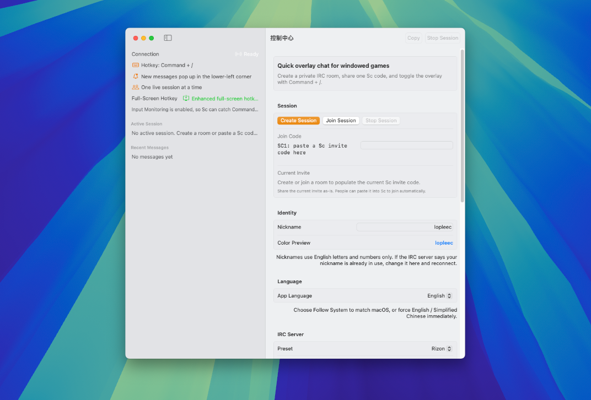

<div align="center">

# Sc

<p>
  
  
  
  
  
</p>

<p>
  <a href="#简体中文">简体中文</a> · <a href="#english">English</a>
</p>

</div>

## Preview



*Control Center / 控制中心*


*Overlay Chat / 悬浮聊天窗*

---

## 简体中文

Sc 是一个用 `Swift + SwiftUI` 构建的 macOS 悬浮聊天工具，面向窗口化或无边框全屏游戏场景。它会为每次会话自动创建一个私密 IRC 房间，并通过一段 `SC1:` 邀请码完成加入流程。

### 功能特性

- 游戏内风格的左下角悬浮聊天栏
- 全局快捷键 `Command + /` 呼出或隐藏聊天输入
- 自动生成随机频道和随机密码的单会话房间
- 粘贴邀请码即可加入，不需要手动填频道和密码
- 新消息隐藏时自动弹出预览
- 图形化设置页，支持昵称、服务器、透明度、字号、宽度等配置
- 支持 `English / 简体中文`，并可在应用内手动切换语言
- 昵称限制为英文和数字，兼容常见 IRC 服务器

### 英文简介

Sc is a lightweight macOS overlay chat app for windowed games. It creates private IRC-backed sessions with shareable invite codes and lets you toggle a lower-left in-game-style chat bar with `Command + /`.

### 运行方式

1. 用 Xcode 打开 `Sc.xcodeproj`
2. 选择 `Sc` scheme
3. 直接运行到本机

也可以直接下载已经编译好的版本：

- [GitHub Releases](https://github.com/lopleec/Sc/releases)

也可以使用命令行构建：

```bash
xcodebuild -project Sc.xcodeproj -scheme Sc -configuration Debug CODE_SIGNING_ALLOWED=NO build
```

### 使用流程

1. 打开应用，进入控制中心
2. 选择“创建会话”或粘贴邀请码加入
3. 进入会话后，用 `Command + /` 呼出聊天栏
4. 在设置页里停止当前会话，或退出应用

### 权限说明

- 普通窗口应用下，全局热键通常可直接使用
- 某些全屏应用需要开启 `Input Monitoring`
- 一般不需要 `Accessibility` 权限

### 语言切换

- 在控制中心的 `语言 / Language` 区域中切换
- 可选：跟随系统、English、简体中文
- 切换后界面会立即刷新

### 目录结构

- `Sc/`：应用源码
- `ScTests/`：单元测试
- `project.yml`：XcodeGen 配置

### License 建议

如果你准备把这个项目公开，我更推荐 `MIT License`：

- 足够简单，分发和商用阻力最小
- 对桌面工具项目很友好
- 便于别人快速 fork 和二次开发

如果你更看重专利授权条款，再考虑 `Apache-2.0`。

---

## English

Sc is a macOS overlay chat app built with `Swift + SwiftUI` for windowed and borderless-fullscreen game setups. Each session creates a private IRC room with a random channel and password, and other players can join by pasting a single `SC1:` invite code.

### Features

- Lower-left in-game-style overlay chat bar
- Global `Command + /` hotkey to show or hide chat input
- One live session at a time, with randomized private room credentials
- Paste-to-join invite flow, no manual channel/password entry
- Auto-preview popups for incoming messages while hidden
- Visual settings for nickname, server, opacity, font size, width, and spacing
- Built-in `English / Simplified Chinese` support with manual in-app switching
- Nicknames restricted to English letters and numbers for IRC compatibility

### Short Description

Sc is a lightweight macOS overlay chat app for windowed games. It creates private IRC-backed sessions with shareable invite codes and lets you toggle a lower-left in-game-style chat bar with `Command + /`.

### Running the App

1. Open `Sc.xcodeproj` in Xcode
2. Select the `Sc` scheme
3. Run it on your Mac

You can also download a prebuilt version directly:

- [GitHub Releases](https://github.com/lopleec/Sc/releases)

Or build from the command line:

```bash
xcodebuild -project Sc.xcodeproj -scheme Sc -configuration Debug CODE_SIGNING_ALLOWED=NO build
```

### Workflow

1. Launch the app and open the control center
2. Create a session or paste an invite code to join one
3. Use `Command + /` to open the overlay chat once connected
4. Stop the session from the settings window when done

### Permissions

- Standard global hotkeys usually work in normal windowed apps
- Some full-screen apps require `Input Monitoring`
- `Accessibility` permission is usually not required

### Language Switching

- Open the `Language` section in the control center
- Choose Follow System, English, or Simplified Chinese
- The UI refreshes immediately after switching

### Project Layout

- `Sc/`: application source
- `ScTests/`: unit tests
- `project.yml`: XcodeGen configuration

### License Recommendation

If you plan to publish the project, `MIT License` is the best default choice here:

- simple and easy to understand
- low-friction for redistribution and commercial use
- ideal for a small desktop utility

If you want a stronger explicit patent grant, consider `Apache-2.0` instead.
